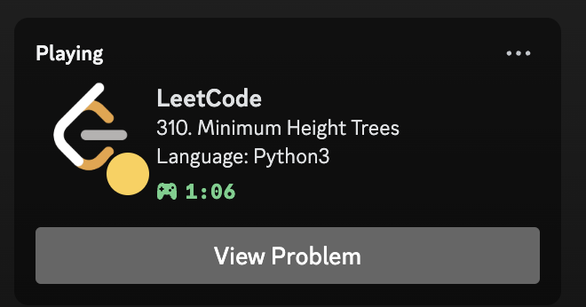
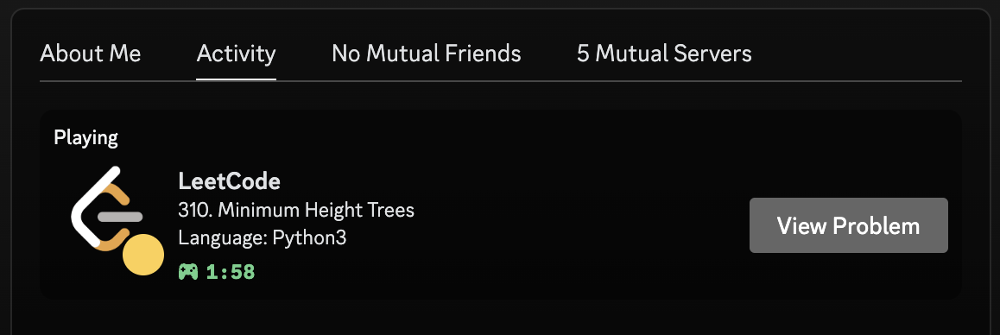

# LeetCode Rich Presence

A simple (work in progress) Discord Rich Presence for LeetCode.
It works through a browser extension that obtains information, and a websocket server to update the status.

